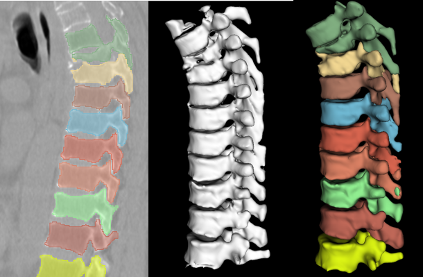
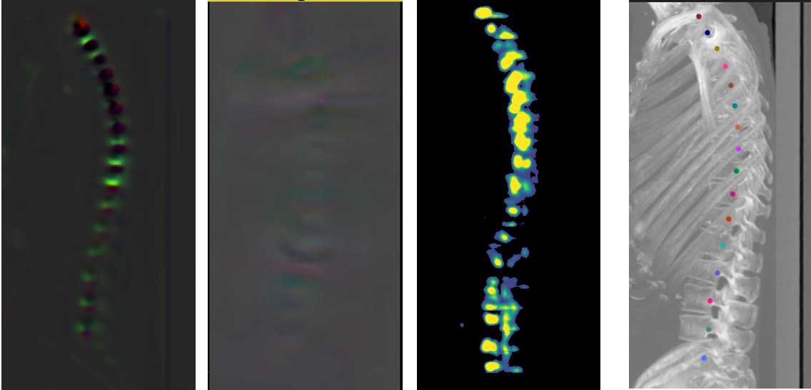

# Train models
The requirements for running project are listed in requirements.txt. To install the requirements, run:`pip install -r requirements.txt`.\
Download the weights and test data and extract them to the project directory.\
[weight&&test_data](https://pan.baidu.com/s/15pVzLb2KWIe4GzVmAucp_g?pwd=w133),passwd:w133
## Datasets
verse2020 datasets [verse2020](https://osf.io/t98fz/).\
data of Guizhou Orthopaedic Hospital (not yet public).

## Dataset preprocessing
In order to unify the data, every image needs to be reoriented to RAI.The transformation script is in `other/preprocess.py`, and set the input folder, output folder and then run it.\
Also need to transform coordinate information by `other/process_landmark_2020.py`.

## Constructing the training dataset
Set `task`, `save_dir`, `dataset_dir` in the `data_generator.py` script to generate training data for the corresponding task.

## Trainning
The training scripts are in the train folder, e.g. To train spine segmentation,run:`python train/train_spine_segment.py --save_dir spine_save --train_dataset_dir spine_train --test_dataset_dir  spine_test --batch_size 8 --n_epoch 100`.\
See the script file for more details.

# Inference
Change the `reference_image_path` and `save_path` in the `test.py` script to reason about a single CT image.\
Set `postprocessing` to enable postprocessing.\
Set `single_channel` to select a different localization model.\
See the script file for more details.
# Eval
Change the `gt_base_folder`, `pred_base_folder`, and `output_folder` in the `eval.py` script to calculate the localization and segmentation metrics.\
See the script file for more details.
# Visualization
visualization tools `3D Slicer`.\

